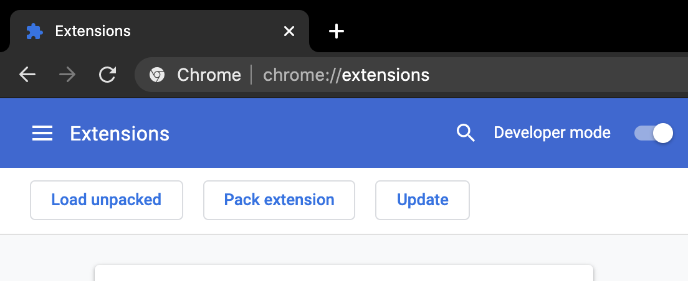
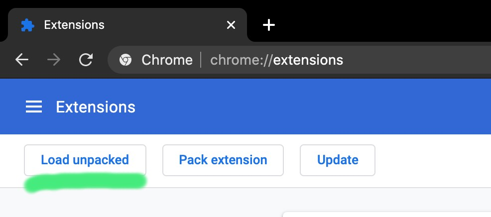

# To Jira from Github

A simple browser extension that lets you jump to relevant JIRA task/story right from a github commit/PR.

 

 

## Installation instruction

Step 1. Clone this repo.

Step 2. Enable chrome extension developer mode.

Step 3. Load extension by clicking "Load unpacked" and locating the repo.

## License

Currently all rights reserved. To be used by bKash labs team for internal development.

